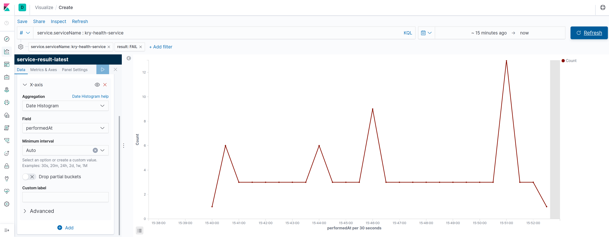
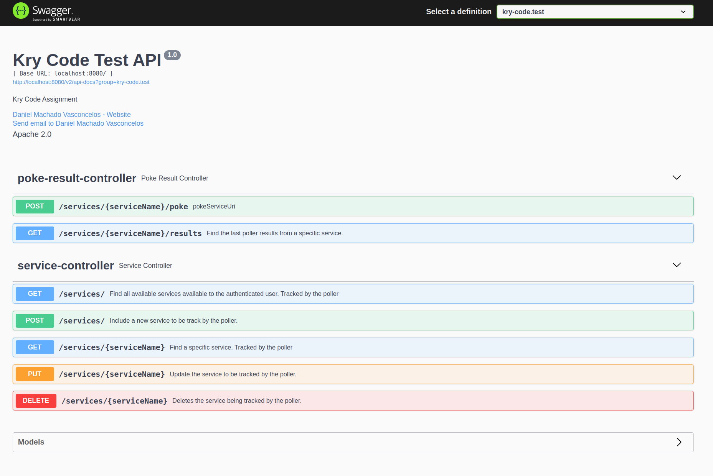

# Kry - Health Check Service

## Daniel Machado Vasconcelos

### Basic requirements (that were implemented):

* A user needs to be able to add a new service with URL and a name
* Added services have to be kept when the server is restarted
* Display the name, url, creation time and status for each service
* Provide a README in english with instructions on how to run the application

### Extra requirements (that were implemented):

* We want full create/update/delete functionality for services;
* The service properly handles concurrent writes;
* URL Validation ("sdgf" is probably not a valid service),
* Protect the poller from misbehaving services (for example answering really slowly),
* Multi user support. Users should not see the services added by another user,

### Extra requirements (not requested but a nice extra to have):

* Custom client errors responses;
* Swagger documentation;
* Expose metrics with spring boot actuator;

### Extra requirements to be done:

* The results from the poller are automatically shown to the user (no need to reload the page to see results)
* We want to have informative and nice looking animations on add/remove services

---
> **_NOTE:_**  PLease see the other repository. 
> I tried to implement those requirements, but it is not my best code, so I consider not implemented. :disappointed:
( [front-end repository](https://github.com/DanielMachadoVasconcelos/kry-code-test-front-end) )
---
Prerequisites
-------------

* Java JDK 11
* Docker and Docker Compose
* A little of Positivity! :)

### Architectural Decisions

**Framework**:
Spring Boot with webflux, running on netty, and accessing the database with reactive repositories. I noticed the
exercise is driving to a reactive approach. So that is why I used Spring Boot Web Flux with Reactive JPA

**Database**:
I think it would be nice to see the responses of the poller over time, so I saved all attempts in Elasticsearch. It is
possible, if needed, to query the results of the poller from the previous days for a specific service.

**Docker Compose**:
Only for test propose. It will spin up an elasticsearch and kibana dashboard containers. I thought it would be nice to
have a way to see the data collected in a dashboard. Not asked! but an extra ;)

**Front-End**:
I decided to create a separate repository for the front-end. I guess this is the best practices of the market. Different teams can work separately. 
I place a attempt of a good front end [here](https://github.com/DanielMachadoVasconcelos/kry-code-test-front-end)

## How to build?

Clone this repo into new project folder (e.g., `kry-service-poller`).

```bash
git clone https://github.com/DanielMachadoVasconcelos/kry-code-test.git
cd kry-code-test
```

Run gradle command to build and run the tests.
**Note:** (A docker container running Elasticsearch database will start on your computer)

```bash
./gradlew clean build
```

## How to use?

### Starting the Application

```bash
./gradlew bootRun 
```

### Check the service is running and health!  \O/

```bash
curl --request GET  --url http://localhost:8081/health 
```

Or

```bash
curl --request GET --url http://localhost:8081/info 
```

### See the data in Kibana!

* Go to your favorite browser and type the url http://localhost:5601
* Find the option 'Dev Tools' on the left menu
* Type the following command in the console:

```
 GET service-result-latest/_search
```

* You can also check the data in a nice graphic on the Dashboard menu: 



### I want to use API's!

No problem: Access the [swagger-ui](http://localhost:8080/swagger-ui/) link to see all the available API's

### Available users (I am using basic Auth for the sake of simplicity)

|username|password|role|
|-----------|----------|-----------|
| user      | password | ROLE_USER
| admin     | password | ROLE_ADMIN


